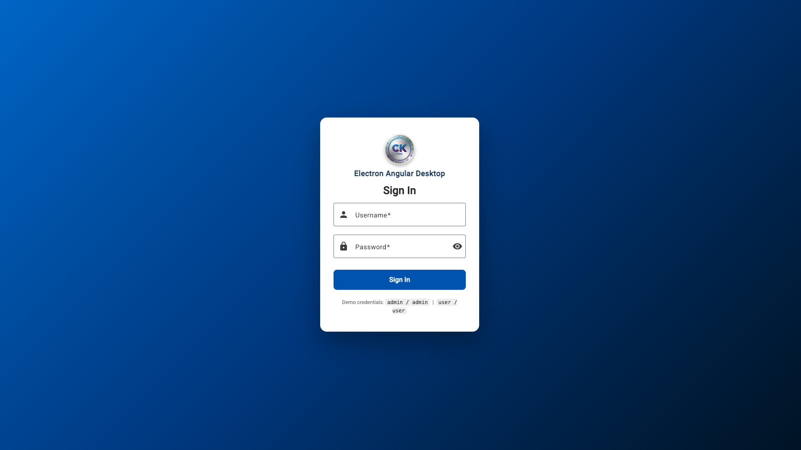
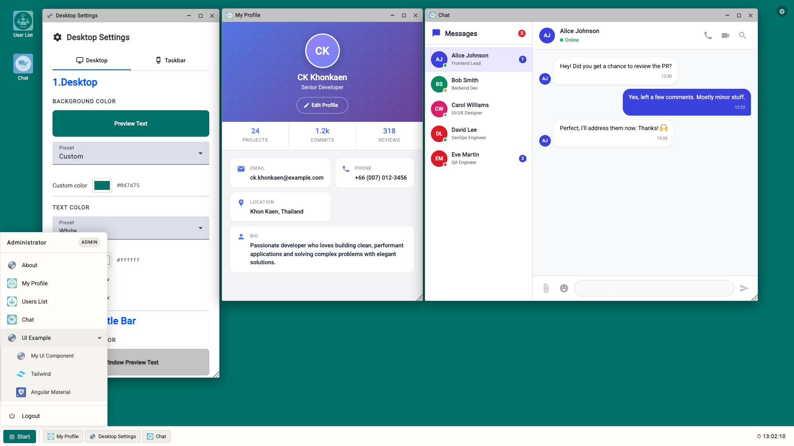
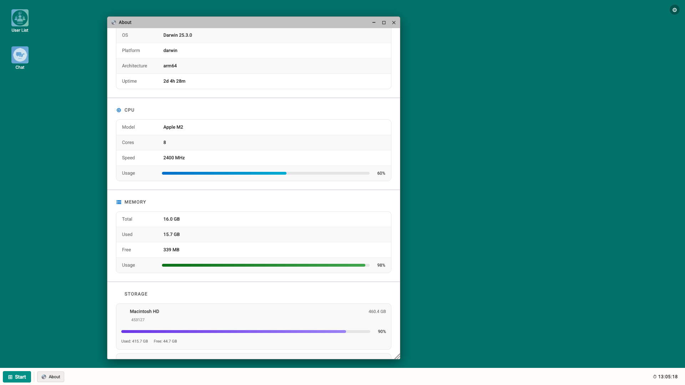
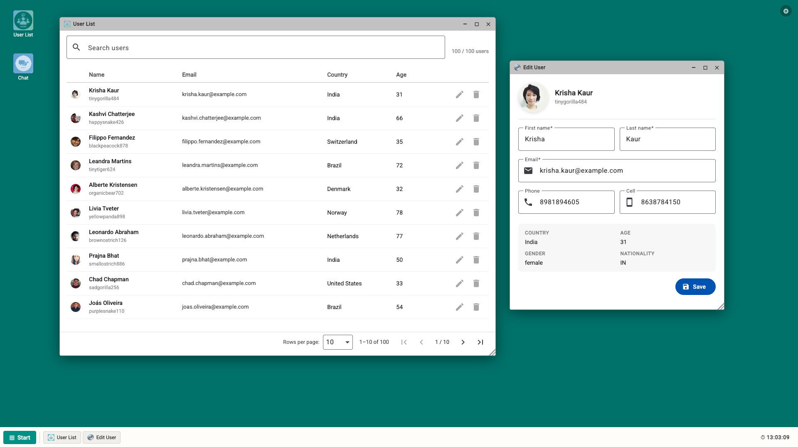
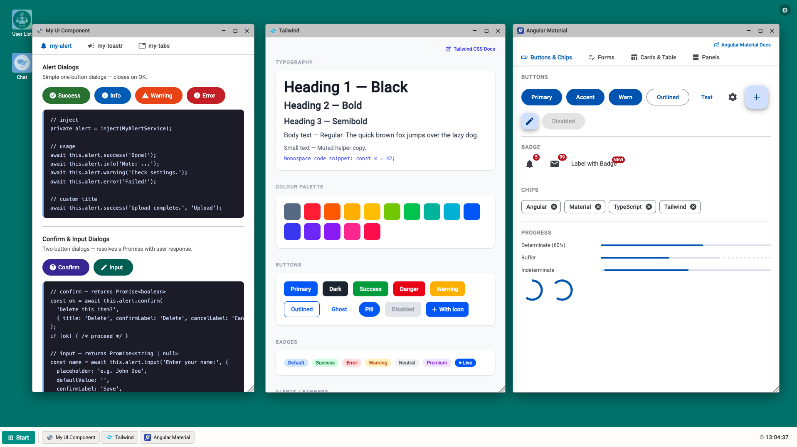

# Electron Angular — Windows-like Desktop

A desktop environment built with **Angular 21** + **Electron**, styled after a Windows-like UI with floating draggable windows, a taskbar, a Start Menu with submenus, and a suite of reusable UI components.

[](https://angular.io)
[](https://electronjs.org)
[](https://tailwindcss.com)
[](https://material.angular.io)
[](LICENSE)

---

## ✨ Features

| Feature | Description |
|---------|-------------|
| 🖥 Desktop environment | Wallpaper, desktop icons, taskbar |
| 🪟 Floating windows | Draggable (clamped), resizable, minimize / maximize / close |
| 📋 Start Menu | Multi-level submenu support |
| 🖱 Taskbar context menu | Right-click any window button → Minimize, Maximize, Close |
| � Taskbar window icons | Each open-window button shows the app icon |
| 🎨 Desktop Settings | Tabbed settings: Desktop (bg, text, window title bar, clock) + Taskbar (bg, text, Start button bg/text) with live preview |
| 🔔 `MyAlert` | Promise-based modal dialogs (success, info, warning, error, confirm, input) |
| 🍞 `MyToastr` | Signal-based toast notifications with auto-dismiss & progress bar |
| 🗂 `MyTabs` | Reusable tab component with `line` and `pill` variants |
| 🎨 Tailwind showcase | Live demo of Tailwind CSS v4 utilities |
| 🧱 Material showcase | Live demo of Angular Material v21 components |
| 👤 Profile | Modern profile page with editable fields |
| 👥 User management | User list window |
| 🔑 Auth | Login page with route guards |
| 💻 About | System info (CPU, Memory, Storage, Network) via Electron preload |
| 💬 Chat | Fake real-time chat with 5 contacts (online/away/busy/offline), typing indicator, auto-replies, and unread badges |

---

## 🖥 Screenshots

### 1. Login Screen


### 2. Desktop Layout


### 3. Computer Detail & Resource Usage


### 4. User CRUD


### 5. Example UI


---

## �🗂 Project Structure

```
src/
├── app/
│   ├── configs/            # Desktop menu & app items config
│   ├── components/
│   │   ├── desktop/        # Desktop, taskbar, window manager
│   │   ├── profile/        # User profile
│   │   ├── user/           # User management
│   │   ├── about/          # About window
│   │   ├── my-ui-example/  # my-alert / my-toastr / my-tabs demo
│   │   ├── tailwind-example/
│   │   └── material-example/
│   └── shares/
│       ├── my-alert/       # Reusable alert/confirm/input dialog
│       ├── my-toastr/      # Reusable toast notification
│       └── my-tabs/        # Reusable tab component
└── main.ts
electron/
└── main.js                 # Electron entry point
```

---

## 🚀 Getting Started

### Prerequisites

- Node.js ≥ 18
- npm ≥ 9

### Install dependencies

```bash
npm install
```

### Run in browser (Angular dev server)

```bash
npm start
# or
npx ng serve
```

Open `http://localhost:4404/`

### Run as Electron app

```bash
npm run electron
```

### Build Angular only

```bash
npx ng build
```

### Build & package Electron (macOS)

```bash
npm run build:macos
```

---

## 🧩 Reusable Components

### `MyAlertService`

```typescript
private alert = inject(MyAlertService);

await this.alert.success('Saved!');
await this.alert.error('Failed!');
const ok   = await this.alert.confirm('Delete?');
const name = await this.alert.input('Enter name:');
```

### `MyToastrService`

```typescript
private toastr = inject(MyToastrService);

this.toastr.success('Record saved!');
this.toastr.error('Request failed.');
const id = this.toastr.info('Loading...', { duration: 0 });
this.toastr.dismiss(id);
```

### `MyTabsModule`

```typescript
imports: [...MyTabsModule]
```

```html
<app-my-tabs variant="line" (tabChange)="onTab($event)">
  <app-my-tab title="General" icon="settings">...</app-my-tab>
  <app-my-tab title="Users"   icon="people">...</app-my-tab>
</app-my-tabs>
```

---

## 🖼 Desktop Menu Config

Add windows by editing `src/app/configs/desktop-menu.ts`:

```typescript
{
  id: 'my-app',
  label: 'My App',
  icon: 'assets/images/logo1.png',
  component: MyApp,
  defaultWidth: 800,   // 0 = open maximized
  defaultHeight: 600,
}
```

> Setting `defaultWidth: 0` **or** `defaultHeight: 0` opens the window maximized.

---

## 🛠 Tech Stack

- **Angular 21** — standalone components, signals, `ChangeDetectionStrategy.OnPush`
- **Electron** — cross-platform desktop shell
- **Angular Material 21** — Azure/Blue theme
- **Tailwind CSS 4** — utility-first styling
- **TypeScript 5** — strict mode

---

## � Changelog

### v1.2.0 — 2026-03-01
- **Chat**: fake real-time chat window with 5 contacts (online / away / busy / offline), typing indicator, auto-replies, unread badges, and per-contact message history

### v1.1.0 — 2026-03-01
- **Taskbar**: each open-window button now displays the app icon alongside the title
- **Settings**: tabbed layout (Desktop / Taskbar); new Taskbar tab with bg colour, text/icon colour, and Start button bg/text colour pickers with live preview
- **Window controls**: min/max/close buttons inherit the title bar text colour; hover uses `currentColor` overlay; close-hover still forces red
- **System info (About)**: CPU, memory, storage (disk), network, runtime info via Electron preload (`sandbox: false`)
- **HDD section**: per-mount progress bars using `df -k` / `wmic`
- **Debug panel**: shown only when `window.electronAPI` is unavailable

### v1.0.0 — 2026-03-01
- Initial release

---

## 📄 License

[MIT](LICENSE) © 2026 superpck

---

## 🤖 Built with GitHub Copilot

This project was developed with the assistance of **[GitHub Copilot](https://github.com/features/copilot)** — an AI-powered coding assistant by GitHub & OpenAI.

---

## 🙏 Acknowledgements

| Resource | Description |
|----------|-------------|
| [Tailwind CSS](https://tailwindcss.com) | Utility-first CSS framework used for rapid UI styling throughout the app |
| [Angular Material](https://material.angular.io) | Component library providing dialogs, buttons, forms, tables, and more |
| [Random User Generator](https://randomuser.me/) | Free API used to generate realistic mock user data for the User management demo |
